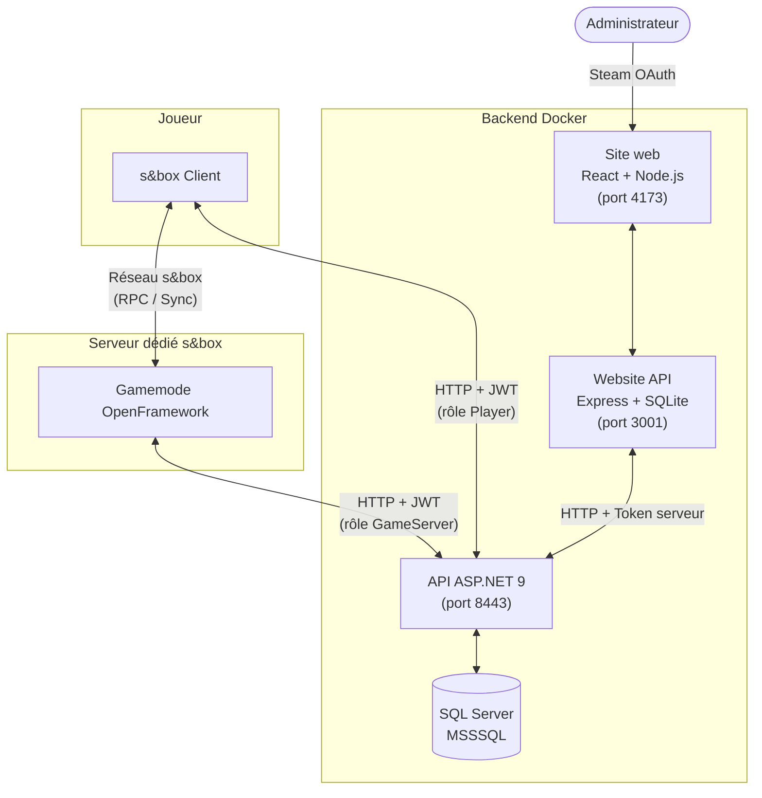
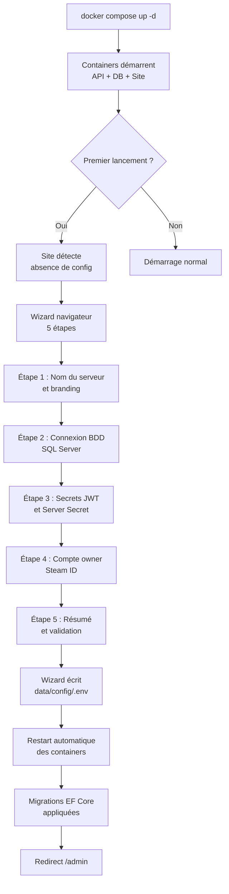
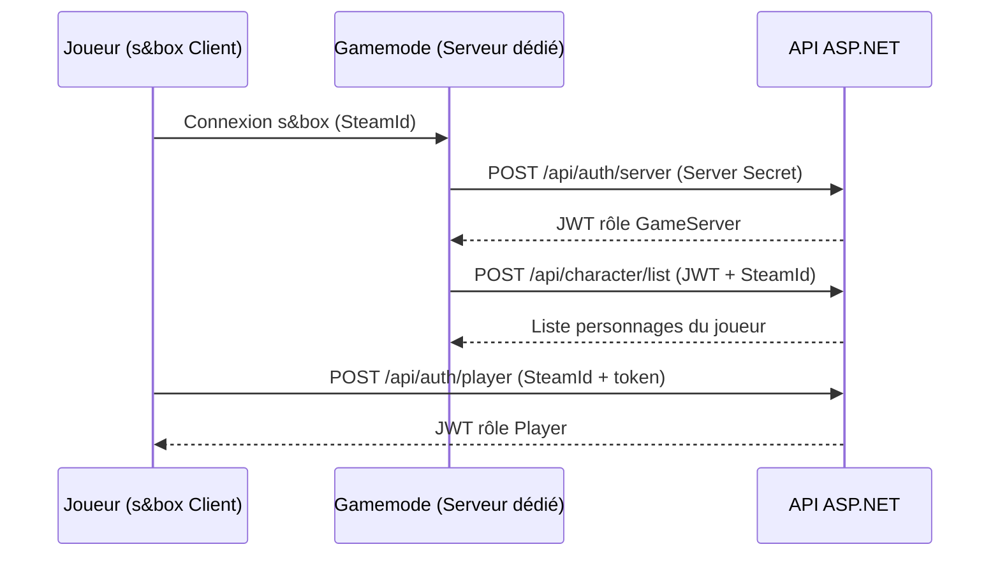

<div align="center">

# OpenFramework Core

**Framework communautaire de roleplay pour [s&box](https://sbox.game)**  
*À la ESX / QBCore de FiveM — un seul `git clone` et tu as tout : gamemode, API, panel admin web.*

[🇬🇧 Read in English](README.md) · [Documentation](docs/SETUP.md) · [Signaler un bug](https://github.com/openframeworkRP/core/issues)

[](LICENSE)
[](https://sbox.game/openframework)

</div>

---

## Qu'est-ce que c'est ?

OpenFramework Core est un framework complet pour héberger un serveur s&box de type roleplay :

- **`gamemode/`** — Le gamemode s&box lui-même (multijoueur dédié, économie, inventaire, jobs, NPC, véhicules, vêtements, etc.)
- **`backend/`** — API .NET 9 + SQL Server : auth Steam, persistance des characters, inventaires, économie, panel admin
- **`website/`** — Site web (Vite + Node.js) : devblog public + panel d'admin web pour la gestion des joueurs

Tout est containerisé sauf le serveur s&box dédié lui-même (qui doit tourner sur une machine avec Steam, comme un serveur FiveM).

---

## Architecture globale



---

## Démarrage rapide (5 min)

### Option 1 — Wizard browser ⭐ recommandé

Lance les services et ouvre automatiquement le wizard de configuration dans ton browser. Tu n'as rien à éditer manuellement — le wizard génère les secrets, te demande ta clé Steam et ton SteamID admin, applique tout.

**Linux / macOS / WSL / Git Bash sur Windows :**
```bash
git clone https://github.com/openframeworkRP/core.git
cd core
bash scripts/first-run.sh
```

**Windows (PowerShell) :**
```powershell
git clone https://github.com/openframeworkRP/core.git
cd core
.\scripts\first-run.ps1
```

### Option 2 — Direct

```bash
git clone https://github.com/openframeworkRP/core.git
cd core
docker compose up -d
# Ouvre http://localhost:4173 → le wizard s'affiche au 1er run
```

### Option 3 — Setup CLI (sans browser)

Si tu préfères tout configurer en ligne de commande, le script `setup.sh` / `setup.ps1` génère le `.env` et te pose les questions dans le terminal.

```bash
bash scripts/setup.sh         # ou .\scripts\setup.ps1
docker compose up -d
```

### Ensuite

Publie le gamemode sur s&box ou monte-le en local — voir **[docs/SETUP.md](docs/SETUP.md)** pour les détails.

---

## Flow d'installation automatique



---

## Gamemode

Le gamemode est développé en **C# sur le moteur s&box** (Facepunch). Il tourne en serveur dédié et synchronise toutes les données via l'API centrale.

### Économie & Commerce

| Système | Description |
|---|---|
| **Banque** | Comptes bancaires multi-membres, fonds de roulement, réserve intouchable, taux d'intérêt, virements entre personnages |
| **Boutiques** | Catalogues configurables via ScriptableObjects (`ShopCatalogueResource`), panneaux 3D interactifs (`ShopSign`) |
| **Armurerie** | Boutique d'armes avec catalogue séparé, licences requises selon le métier |
| **Vêtements** | Magasin de fringues avec cabine d'essayage 3D, catalogue par genre et catégorie |
| **ATM** | Distributeurs placés dans la map, retrait/dépôt liés à l'API bancaire |
| **Argent liquide** | Système monétaire distinct du bancaire, transactions de la main à la main |

### Métiers & Roleplay

9 métiers jouables, chacun avec ses permissions, outils et tâches propres :

```
Citizen      — métier par défaut, accès aux activités civiles
Police       — MDT, menottes, accès armurerie service, dispatch
Médecin      — défibrillateur, soins, réponse urgences
Maire        — tâches administratives, décisions serveur
Armurier     — vente légale d'armes, gestion stock
Cuisinier    — stations de cuisine, recettes, vente plats
Maintenance  — réparations, tâches techniques programmées
Éboueur      — collecte déchets, itinéraires de tournée
Intérimaire  — missions ponctuelles multi-secteurs
```

- **Système de vote** pour changer de métier (`JobVoteSystem`)
- **Tâches métier** (`JobTask`) — objectifs assignés selon le rôle, trackés en temps réel
- **Dispatch** — appels radio centralisés pour police et médecins, avec type et priorité

### Inventaire & Crafting

- **Grille d'inventaire** — drag & drop, stack, split, inspection des items
- **Crafting** — table d'artisanat avec recettes configurables
- **Cuisine complète** — planches à découper, friteuses, grills, fontaine à soda, assemblage de burgers
- **Armes** — équipement porté, armes larguées récupérables, patterns de recul configurables
- **Radio** — communication par fréquence entre joueurs équipés
- **Téléphone** — item portable avec interface dédiée

### Véhicules

- **Physique avancée** — transmission, embrayage, différentiel, assemblage de roues physiques
- **Sièges multiples** — conducteur + passagers avec animations synchronisées
- **Portes interactives** — ouverture/fermeture 3D

### PNJ & IA

- **NpcManager** — spawn et gestion du cycle de vie des PNJ
- **Comportements modulaires** : `PedestrianBehavior`, `RoamBehavior`, `CombatBehavior`
- **Arbre de nœuds** — ciblage, déplacement, tir, émotes aléatoires
- **Traffic** — véhicules PNJ circulant sur la map

### Environnement & Monde

- **Cycle jour/nuit** — horloge serveur synchronisée sur tous les clients
- **Météo** — système météorologique avec transitions
- **Minimap & GPS** — blips dynamiques, navigation en jeu
- **Audio zonalisé** — isolation acoustique par pièce
- **Meubles interactifs** — chaises, fenêtres, lampes, placement libre

### Systèmes transversaux

| Système | Description |
|---|---|
| **Chat** | Chat en jeu avec portée de voix et canaux globaux |
| **Menu radial** | Roue contextuelle d'actions selon l'environnement |
| **Commandes admin** | Queue de commandes web → serveur, kick/ban/whitelist/jail |
| **Hub MDT Police** | Terminal embarqué : casier judiciaire, ajout d'infractions |
| **Anti-triche** | Validation serveur des actions sensibles |
| **Spectateur** | Mode spectateur post-mort |

---

## API (ASP.NET 9)

### Flow d'authentification



### Endpoints principaux

```
# Personnages
POST   /api/character/create
PUT    /api/character/{id}/appearance
POST   /api/character/{id}/changeActualJob
DELETE /api/character/{id}/delete

# Inventaire
GET    /api/characters/actual/inventory/get
POST   /api/characters/actual/inventory/add
POST   /api/characters/actual/inventory/delete

# Banque
POST   /api/bank/accounts/create
GET    /api/bank/accounts/{characterId}
POST   /api/bank/transfer

# Police MDT
GET    /api/mdt/criminalrecord/{characterId}
POST   /api/mdt/criminalrecord/{id}/addrecord

# Administration
POST   /api/admin/ban/
POST   /api/admin/whitelist/
POST   /api/admin/command/queue
GET    /api/admin/command/pending
```

Référence complète : **[docs/API.md](docs/API.md)**

---

## Site Web

- **Public** — devlogs, wiki, règles du serveur, offres de recrutement, profils d'équipe, multilingue FR/EN
- **Panel admin** — Steam OAuth, gestion du contenu, logs d'actions en temps réel, bans/whitelist/jail, envoi de commandes au serveur dédié
- **Hub interne** — gestion de projets, idées, tâches d'équipe

---

## Structure du repo

```
core/
├── gamemode/                   # Le gamemode s&box
│   ├── core.sbproj             # Projet s&box (publie comme openframework.core)
│   ├── Code/                   # Sources C#
│   └── Assets/                 # Models, materials, scenes, prefabs
├── backend/                    # API .NET 9 + EF Core
│   ├── OpenFramework.Api/      # Controllers, DTOs, DbContext
│   └── compose.yaml
├── website/                    # Devblog + admin web
│   ├── frontend/               # Vite + React
│   ├── backend/                # Node.js + SQLite + Steam auth
│   └── docker-compose.yml
├── docker-compose.yml          # Orchestration globale
├── .env.example                # Variables d'environnement
└── docs/                       # Documentation
```

---

## Prérequis

- **Docker** + **Docker Compose** (pour API + DB + website)
- **s&box** (Steam) avec accès dev pour publier le gamemode
- **Clé API Steam** : [https://steamcommunity.com/dev/apikey](https://steamcommunity.com/dev/apikey)

---

## Documentation

- **[docs/SETUP.md](docs/SETUP.md)** — Guide complet de setup self-hosted
- **[docs/CONFIG.md](docs/CONFIG.md)** — ConVars du gamemode et options de config
- **[docs/API.md](docs/API.md)** — Référence des endpoints de l'API .NET
- **[CONTRIBUTING.md](CONTRIBUTING.md)** — Guide de contribution

---

## Contraintes techniques

- **Multijoueur dédié** obligatoire — chaque feature doit fonctionner en serveur dédié, pas seulement en listen server.
- **Anti-duplication** — toutes les manipulations d'items/argent doivent être atomiques côté host.
- **Langue** — code, commentaires, commits et issues en français (par cohérence avec l'historique).

Détails dans [CONTRIBUTING.md](CONTRIBUTING.md).

---

## Contribuer

Les contributions sont les bienvenues. Ouvrir une issue avant toute PR de fond.

- Fork → branche feature → PR vers `main`
- Un système par PR, commits descriptifs
- Les features multijoueur doivent fonctionner sur **serveur dédié**

---

## Licence

[MIT](LICENSE) — fais-en ce que tu veux, contribue si tu veux.

---

> Ce projet est indépendant de Facepunch Studios. s&box est une marque déposée de Facepunch Studios Ltd.  
> Fork de l'ancien gamemode `small_life`, passé open source en 2026 pour devenir un framework communautaire.
