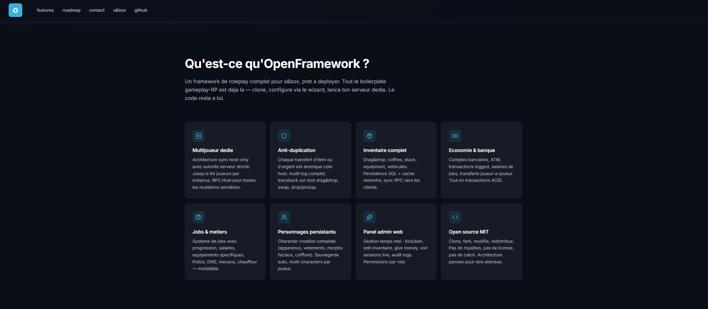
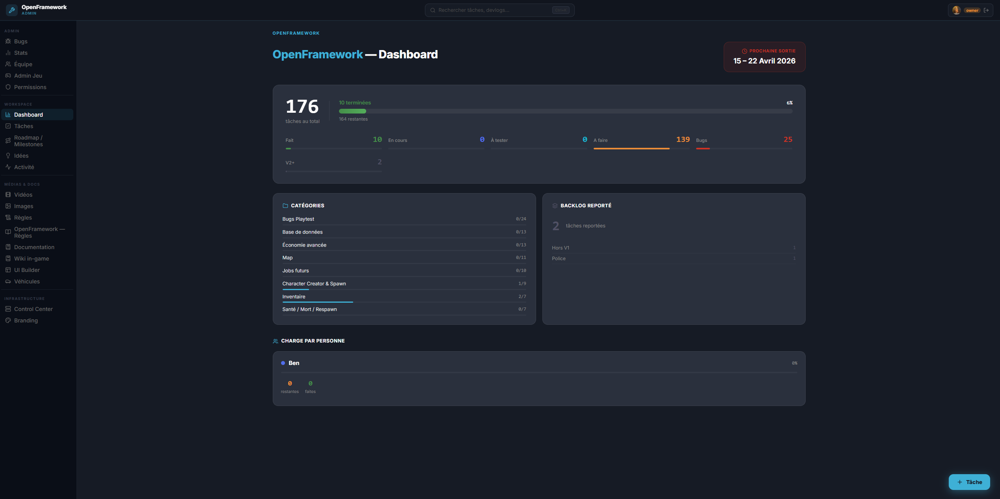
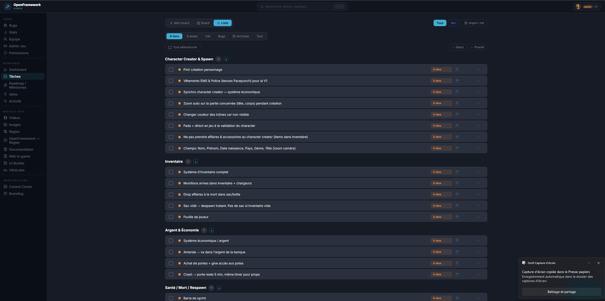
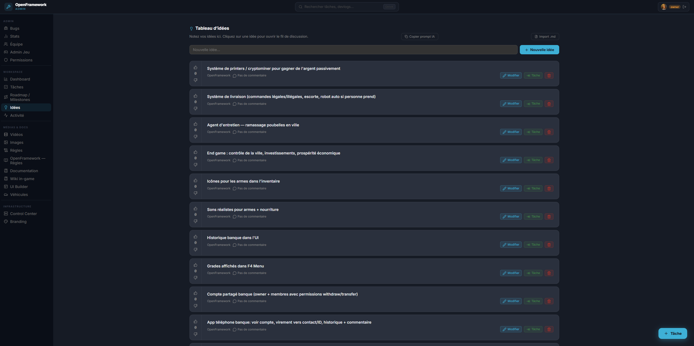
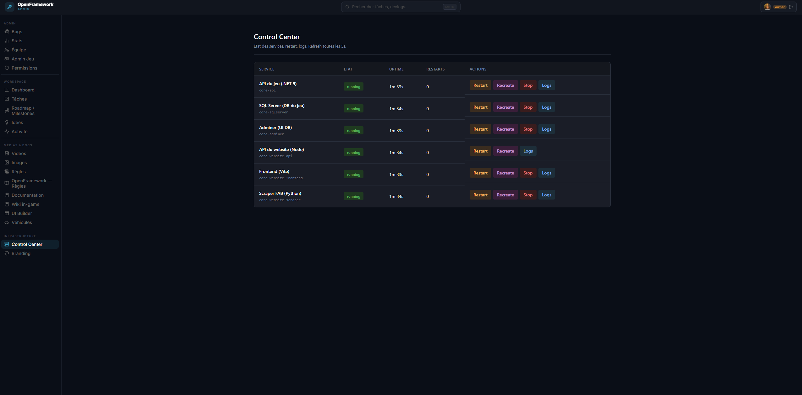
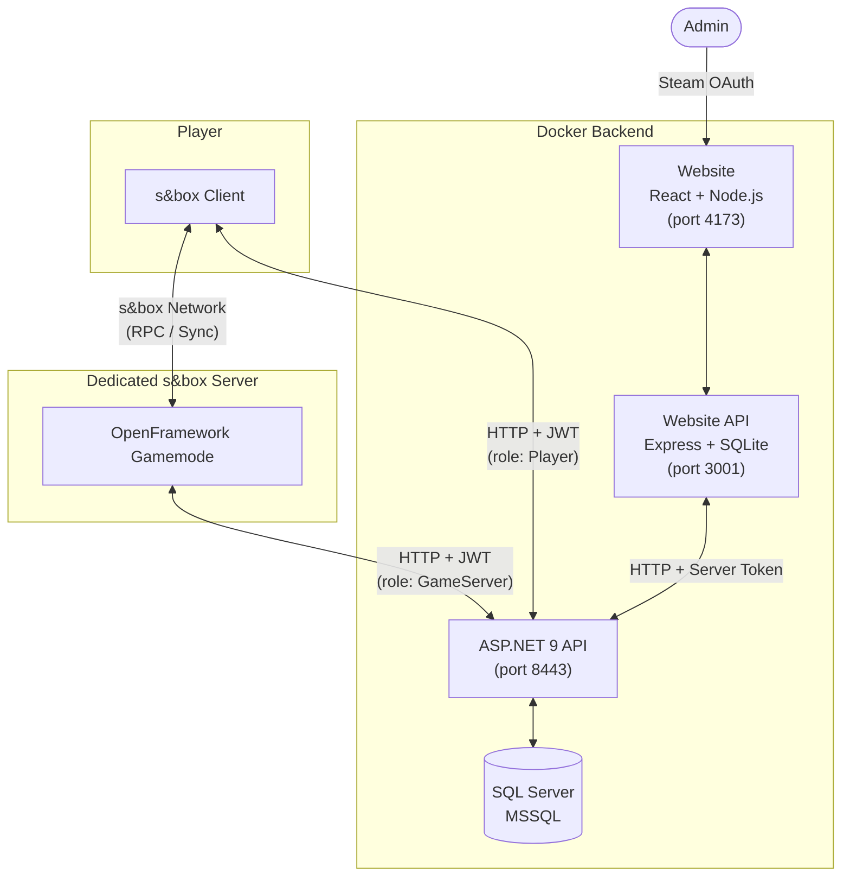
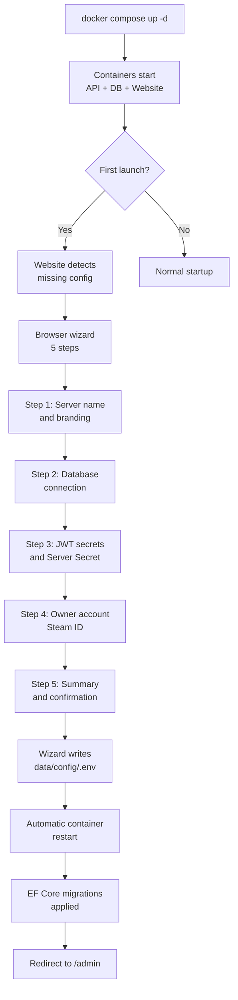
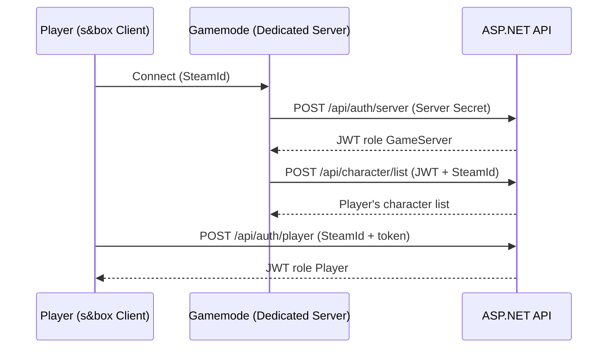

<div align="center">

# OpenFramework Core

**A community roleplay framework for [s&box](https://sbox.game)**  
*Like ESX / QBCore for FiveM — one `git clone` and you have everything: gamemode, API, admin web panel.*

[🇫🇷 Lire en français](README.fr.md) · [Documentation](docs/SETUP.md) · [Report a bug](https://github.com/openframeworkRP/core/issues)

[](LICENSE)
[](https://sbox.game/openframework)

</div>

---

## What is it?

OpenFramework Core is a complete framework for hosting an s&box roleplay server:

- **`gamemode/`** — The s&box gamemode itself (dedicated multiplayer, economy, inventory, jobs, NPCs, vehicles, clothing, etc.)
- **`backend/`** — .NET 9 API + SQL Server: Steam auth, character persistence, inventories, economy, admin panel
- **`website/`** — Website (Vite + Node.js): public devblog + web admin panel for player management

Everything is containerised except the s&box dedicated server itself (which must run on a machine with Steam, just like a FiveM server).

---

## Screenshots

### Website — Admin Panel

<div align="center">
  
  
  
  
  
</div>

> *Screenshots of the built-in admin panel: dashboard, task management, ideas board, and Docker service control.*

---

## Global Architecture



---

## Quick Start (5 min)

### Option 1 — Browser wizard ⭐ recommended

Starts the services and automatically opens the configuration wizard in your browser. No manual editing required — the wizard generates secrets, asks for your Steam key and admin SteamID, and applies everything.

**Linux / macOS / WSL / Git Bash on Windows:**
```bash
git clone https://github.com/openframeworkRP/core.git
cd core
bash scripts/first-run.sh
```

**Windows (PowerShell):**
```powershell
git clone https://github.com/openframeworkRP/core.git
cd core
.\scripts\first-run.ps1
```

### Option 2 — Direct

```bash
git clone https://github.com/openframeworkRP/core.git
cd core
docker compose up -d
# Open http://localhost:4173 → the wizard appears on first run
```

### Option 3 — CLI setup (no browser)

If you prefer to configure everything from the command line, `setup.sh` / `setup.ps1` generates the `.env` and asks questions in the terminal.

```bash
bash scripts/setup.sh         # or .\scripts\setup.ps1
docker compose up -d
```

### After setup

Publish the gamemode on s&box or run it locally — see **[docs/SETUP.md](docs/SETUP.md)** for details.

---

## Automated Setup Flow



---

## Gamemode

The gamemode is written in **C# on the s&box engine** (Facepunch). It runs on a dedicated server and synchronises all state through the central API.

### Economy & Commerce

| System | Description |
|---|---|
| **Bank** | Multi-member bank accounts, working capital, untouchable reserve, interest rate, inter-character transfers |
| **Shops** | Configurable catalogues (`ShopCatalogueResource`), interactive 3D signs (`ShopSign`) |
| **Gun Store** | Separate weapon catalogue, job-gated licenses |
| **Clothing Store** | Full outfit shop with 3D changing room, catalogue by gender and category |
| **ATM** | Dispensers placed on the map, deposit/withdraw linked to the banking API |
| **Cash** | Physical money distinct from bank balance, hand-to-hand transactions |

### Jobs & Roleplay

9 playable jobs, each with its own permissions, tools, and tasks:

```
Citizen      — default job, access to civilian activities
Police       — MDT, handcuffs, service armoury, dispatch
Medic        — defibrillator, healing, emergency response
Mayor        — administrative tasks, server-wide decisions
Gunsmith     — legal weapon sales, stock management
Cook         — cooking stations, recipes, meal sales
Maintenance  — repairs, scheduled technical tasks
Garbage Man  — waste collection, route-based objectives
Temp Worker  — short-term missions across multiple sectors
```

- **Job vote system** — players vote to change job (`JobVoteSystem`)
- **Job tasks** (`JobTask`) — real-time objectives assigned per role
- **Dispatch** — centralised radio calls for police and medics, with type and priority

### Inventory & Crafting

- **Grid inventory** — drag & drop, stacking, splitting, item inspection
- **Crafting** — crafting table with configurable recipes
- **Full cooking** — cutting boards, fryers, grills, soda fountains, burger assembly
- **Weapons** — carried equipment, droppable/retrievable weapons, configurable recoil patterns
- **Radio** — frequency-based communication between equipped players
- **Phone** — portable item with dedicated UI

### Vehicles

- **Advanced physics** — transmission, clutch, differential, physical wheel assembly
- **Multi-seat** — driver + passengers with synchronised animations
- **Interactive doors** — 3D open/close

### NPCs & AI

- **NpcManager** — spawning and lifecycle management
- **Modular behaviours** : `PedestrianBehavior`, `RoamBehavior`, `CombatBehavior`
- **Node tree** — targeting, pathfinding, shooting, random emotes
- **Traffic** — NPC vehicles driving around the map

### World & Environment

- **Day/night cycle** — server clock synchronised across all clients
- **Weather** — weather system with smooth transitions
- **Minimap & GPS** — dynamic blips, in-game navigation
- **Zoned audio** — room-based acoustic isolation
- **Interactive furniture** — chairs, windows, lamps, free placement

### Cross-cutting Systems

| System | Description |
|---|---|
| **Chat** | In-game chat with voice range and global channels |
| **Radial menu** | Context-sensitive action wheel based on surroundings |
| **Admin commands** | Web → server command queue, kick/ban/whitelist/jail |
| **Police MDT** | Onboard terminal: criminal records, add offences |
| **Anti-cheat** | Server-side validation of sensitive actions |
| **Spectator** | Post-death spectator mode |

---

## API (ASP.NET 9)

### Authentication Flow



### Key Endpoints

```
# Characters
POST   /api/character/create
PUT    /api/character/{id}/appearance
POST   /api/character/{id}/changeActualJob
DELETE /api/character/{id}/delete

# Inventory
GET    /api/characters/actual/inventory/get
POST   /api/characters/actual/inventory/add
POST   /api/characters/actual/inventory/delete

# Bank
POST   /api/bank/accounts/create
GET    /api/bank/accounts/{characterId}
POST   /api/bank/transfer

# Police MDT
GET    /api/mdt/criminalrecord/{characterId}
POST   /api/mdt/criminalrecord/{id}/addrecord

# Administration
POST   /api/admin/ban/
POST   /api/admin/whitelist/
POST   /api/admin/command/queue
GET    /api/admin/command/pending
```

Full reference: **[docs/API.md](docs/API.md)**

---

## Website

- **Public** — devlogs, wiki, server rules, job listings, team profiles, EN/FR multilingual
- **Admin panel** — Steam OAuth, content management, real-time action logs, bans/whitelist/jail, send commands to the dedicated server
- **Internal hub** — project management, ideas, team tasks

---

## Repo Structure

```
core/
├── gamemode/                   # The s&box gamemode
│   ├── core.sbproj             # s&box project (publishes as openframework.core)
│   ├── Code/                   # C# sources
│   └── Assets/                 # Models, materials, scenes, prefabs
├── backend/                    # .NET 9 API + EF Core
│   ├── OpenFramework.Api/      # Controllers, DTOs, DbContext
│   └── compose.yaml
├── website/                    # Devblog + admin web
│   ├── frontend/               # Vite + React
│   ├── backend/                # Node.js + SQLite + Steam auth
│   └── docker-compose.yml
├── docker-compose.yml          # Global orchestration
├── .env.example                # Environment variables template
└── docs/                       # Documentation
```

---

## Prerequisites

- **Docker** + **Docker Compose** (for API + DB + website)
- **s&box** (Steam) with dev access to publish the gamemode
- **Steam API key**: [https://steamcommunity.com/dev/apikey](https://steamcommunity.com/dev/apikey)

---

## Documentation

- **[docs/SETUP.md](docs/SETUP.md)** — Full self-hosted setup guide
- **[docs/CONFIG.md](docs/CONFIG.md)** — Gamemode ConVars and config options
- **[docs/API.md](docs/API.md)** — .NET API endpoint reference
- **[CONTRIBUTING.md](CONTRIBUTING.md)** — Contribution guide

---

## Technical Constraints

- **Dedicated multiplayer** required — every feature must work on a dedicated server, not just listen server.
- **Anti-duplication** — all item/money operations must be atomic on the host side.

Details in [CONTRIBUTING.md](CONTRIBUTING.md).

---

## Contributing

Contributions are welcome. Please open an issue before submitting any significant PR.

- Fork → feature branch → PR to `main`
- One system per PR, descriptive commits
- Multiplayer features **must work on a dedicated server**

---

## License

[MIT](LICENSE) — do whatever you want with it, contribute if you feel like it.

---

> This project is independent of Facepunch Studios. s&box is a trademark of Facepunch Studios Ltd.  
> Forked from the original `small_life` gamemode, open-sourced in 2026 as a community framework.
